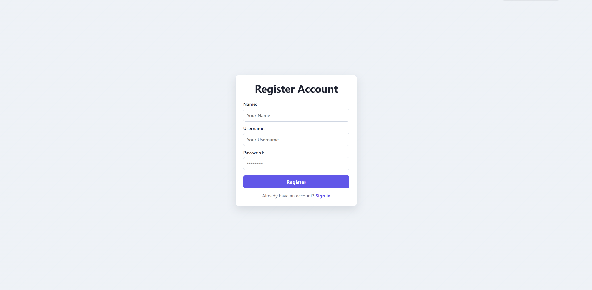
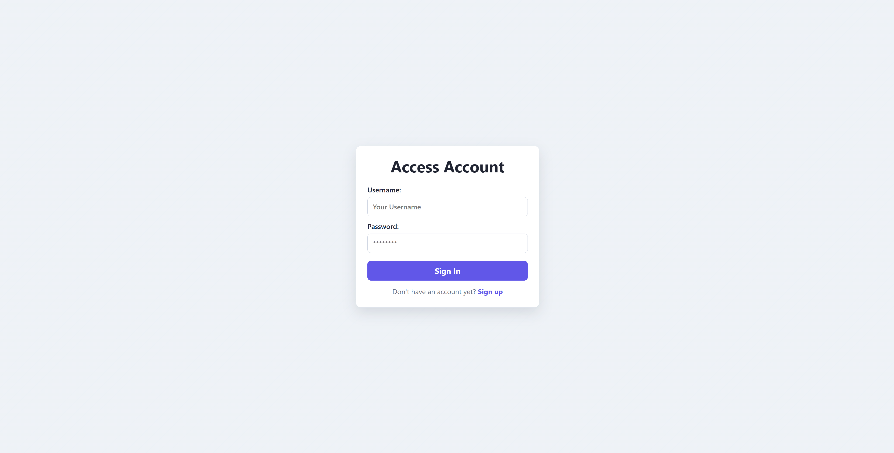
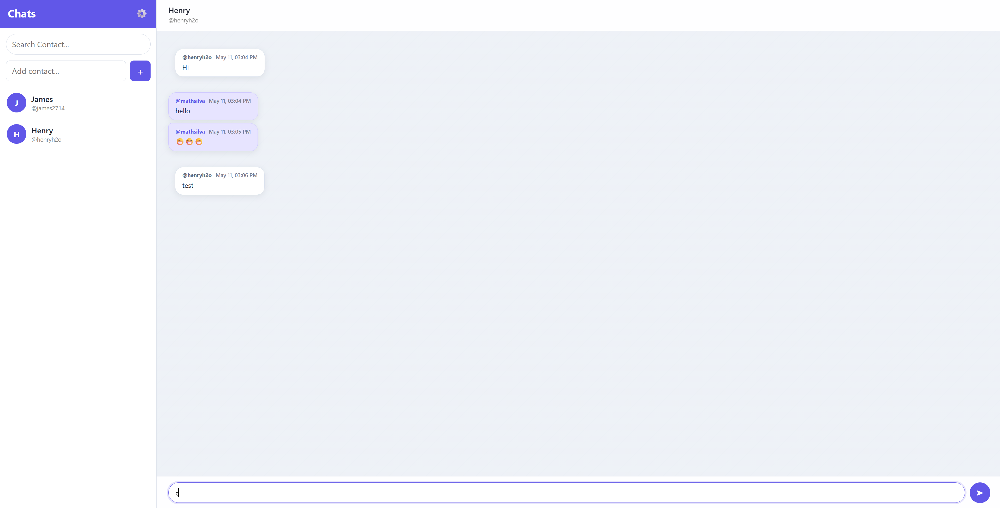
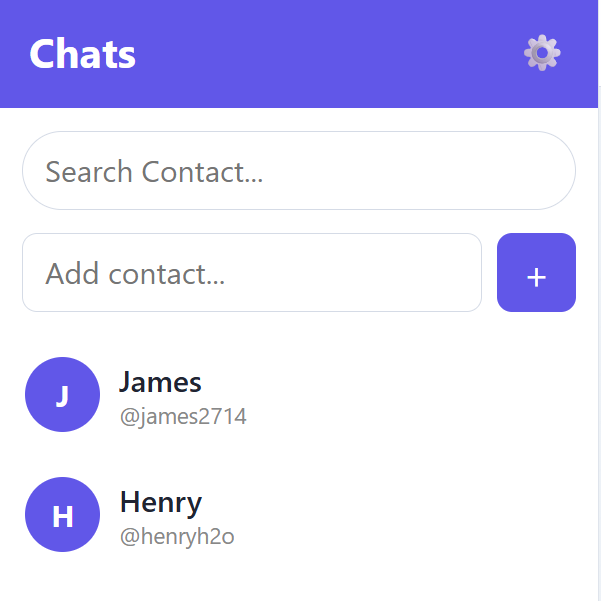

# Realtime Chat

Fullstack private chat application with authentication, contacts and real-time messages using WebSocket/STOMP.

Live deployment: https://realtime-chat-app-rpzg.onrender.com/

## Screenshots






## Stack

**Frontend**

- Angular 20
- TypeScript
- SCSS
- RxJS
- STOMP over WebSocket

**Backend**

- Java 21
- Spring Boot 4
- Spring Security
- Spring Data JPA
- WebSocket/STOMP
- H2 for local development
- PostgreSQL on deployment
- Maven

## Features

- User registration and login
- JWT authentication
- Protected frontend routes
- Contact search and contact creation
- Real-time private messages
- Message history by contact
- Basic backend tests for authentication

## Running Locally

Requirements: Java 21+, Node.js, npm and OpenSSL.

Create JWT keys:

```bash
cd backend/src/main/resources/keys
openssl genrsa -out jwt-private.key 4096
openssl rsa -in jwt-private.key -pubout -out jwt-public.key
```

Run the backend:

```bash
cd backend
./mvnw spring-boot:run
```

On Windows:

```bash
cd backend
mvnw.cmd spring-boot:run
```

Run the frontend:

```bash
cd frontend
npm install
npm start
```

URLs:

```text
Backend:  http://localhost:8080
Frontend: http://localhost:4200
```

## API Overview

- `POST /api/auth/register` - create account
- `POST /api/auth/login` - login and receive JWT
- `GET /api/me` - authenticated user data
- `GET /api/me/contacts` - list contacts
- `POST /api/me/contacts/find` - search users
- `POST /api/me/contacts` - add contact
- `GET /api/me/messages/{contactId}` - message history
- `/ws` - WebSocket endpoint

## Testing

```bash
cd backend
./mvnw test
```

```bash
cd frontend
npm test
```

## Project Structure

```text
backend/
|-- application
|   |-- auth
|   |-- contact
|   |-- message
|   `-- user
|-- domain
|   |-- message
|   |-- role
|   |-- user
|   `-- usercontact
|-- infrastructure
|   |-- exception
|   |-- security
|   `-- web
`-- common

frontend/     Angular application
docs/         screenshots
```

## Author

Matheus Silva  
GitHub: [MathSilvaDev](https://github.com/MathSilvaDev)
